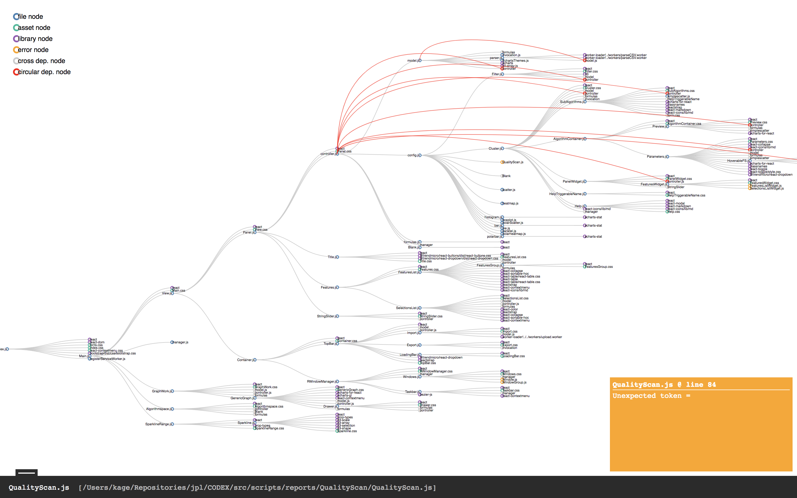

# depgraph

## Purpose

Create a dependency graph of your project, highlighting circular dependencies and cross dependencies.

## Screenshots



## Getting started

```
$ git clone https://github.com/quadnix/depgraph && cd depgraph
$ npm i -g
```

## Usage

Depgraph comes in two parts - a CLI and a visualization. The cli is very easy to use:

```
  Usage: depgraph [options]

  Options:

    -V, --version        output the version number
    -t, --target <file>  Root file of project
    -o, --output <file>  File to output to
    -h, --help           output usage information
```

An example that will read a project rooted at `goat/index.js` and output to stdout:

```
$ depgraph -t goat/index.js -o -
```

Depgraph will spit some information onto stderr, if you want something completely silent try:

```
$ depgraph -t goat/index.js -o - 2> /dev/null
```

For the visualisation, copy (or symlink) the output file to the root of the `viz/` folder, and name it `depgraph.json`. Then simply serve it behind an HTTP server. I like [this one](https://www.npmjs.com/package/http-server).
